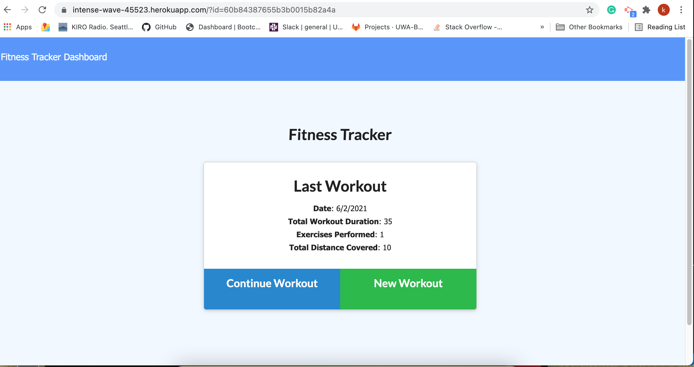
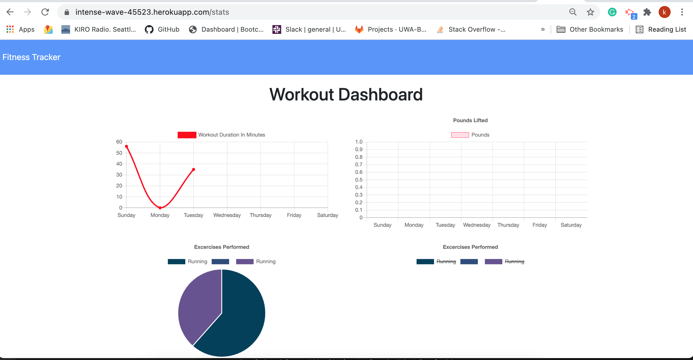

# Fitness Tracker

## Table of Contents 

* [Usage](#usage)
* [User Story](#userstory)
* [Objective](#objective)
* [Technologies](#technologies)
* [Credits](#credits)
* [License](#license)

## Usage 

Example of front page

Example of dashboard page

Heroku Deployment (https://intense-wave-45523.herokuapp.com/)

# User Story
As a user, I want to be able to view create and track daily workouts. I want to be able to log multiple exercises in a workout on a given day. I should also be able to track the name, type, weight, sets, reps, and duration of exercise. If the exercise is a cardio exercise, I should be able to track my distance traveled.

# Objective
A workout tracker using Mongo database with a Mongoose schema to handle routes with Express.

# Technologies
* Javascript
* Node.js
* Express
* MongoDB
* Mongoose

## Questions
If you have any questions about the repo, please [open an issue](https://github.com/Ofarrell23/fitness-tracker/issues or contact me via email at keyabug@gmail.com. You can find more of my work on my GitHub, [Ofarrell23](https://github.com/Ofarrell23/).
    
## Credits
Below is a list of third-party tutorials used to help facilitate this project. There were no collaborators for this project.

* [Credits] (https://www.w3schools.com/tags/att_img_alt.asp)
* [Credits] (https://www.vikingcodeschool.com/html5-and-css3/html5-semantic-tags)
* [Credits] (https://developer.mozilla.org/en-US/docs/Web/JavaScript)

# License

